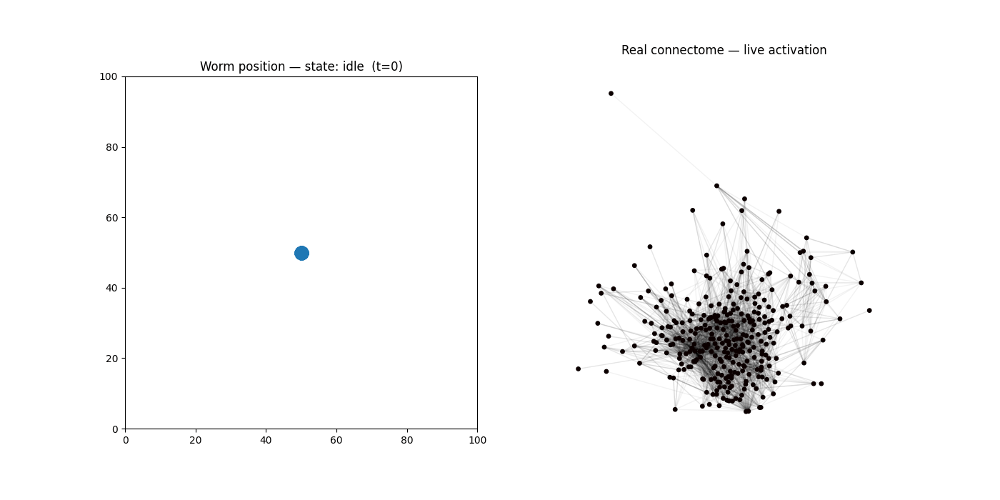

# Digital Worm

A simulation of *C. elegans* — the roundworm whose entire nervous system
(302 neurons) has been fully mapped — built on the real, published
connectome instead of synthetic data.

At the core of this is a recurrent neural network where the weights aren't
learned or randomly initialized — they're the actual synaptic connections
between real neurons, taken from the original 1986 electron-microscopy
reconstruction of the worm's brain. Each neuron is a simple leaky-integrate
unit; activation flows through the graph exactly the way it would through
any RNN, except the connectivity is biology instead of `torch.nn.RNN`
weights.

I stimulate real sensory neurons (touch receptors), let the network
propagate activation through ~3,500 real synapses, and read the response
off real motor neurons to drive a small 2D worm agent — closely modeled on
the touch-withdrawal reflex, the best-documented sensorimotor circuit in
the organism.

## The interesting part

The raw connectome only gives you synapse *counts*, not whether a
connection is excitatory or inhibitory. Since real locomotor switching in
*C. elegans* depends heavily on inhibition, a purely excitatory network
(what you get from counts alone) can't reproduce the correct reflex
direction on its own — I confirmed this empirically instead of assuming it.
So the network is used for what it's genuinely good at (a live, real
activation trace across the actual nervous system), while movement
direction uses the documented circuit logic directly. That split is a
design decision, not a workaround, and it's the kind of constraint you only
find by actually running real data through a model instead of a toy
dataset.

## Demo



Red = backward (after front touch), green = forward (after back touch). The
right panel is the real connectome, lighting up with actual simulated
activation as it runs.

## Stack

Python, NumPy, NetworkX for the graph and dynamics; FastAPI + Docker for
deployment.

## Running it

```bash
pip install -r requirements.txt
python visualize.py          # produces worm_demo.gif
```

```bash
docker build -t digital-worm .
docker run -p 8000:8000 digital-worm
```
Visit `http://localhost:8000/docs` for the interactive API.

Requires `connectome.csv` (White et al. 1986, via [OpenWorm's
ConnectomeToolbox](https://github.com/openworm/ConnectomeToolbox)) in a
`data/` subfolder.

